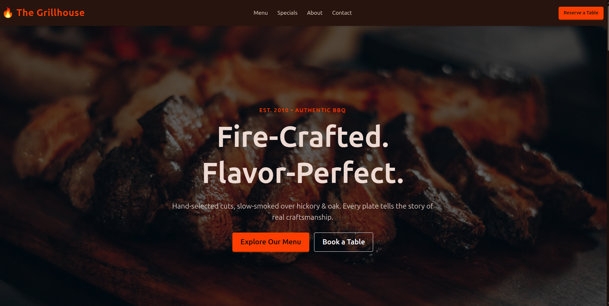
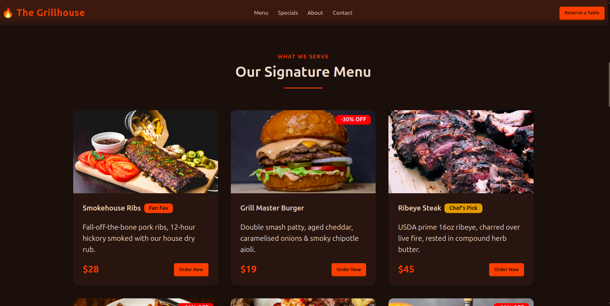

# The Grillhouse - Fire & Flavor 🔥



A modern, responsive landing page for a fictional premium BBQ restaurant, "The Grillhouse". This project showcases the power of **daisyUI 5** and **Tailwind CSS 4** for building beautiful, themeable user interfaces with minimal custom CSS.

## About The Project

This repository serves as a practical example of integrating the latest front-end tooling to create a cohesive brand identity for a restaurant website. Key features include:

- **Custom Theming**: A unique "grillhouse" theme defined using OKLCH colors to create a warm, smoky atmosphere.
- **Responsive Design**: A mobile-first layout that adapts seamlessly to all screen sizes.
- **Component-Based UI**: Utilizes daisyUI's pre-built components like Navbar, Hero, Stats, Cards, and Footer for rapid development.
- **Modern Tooling**: Built with Vite for lightning-fast development and optimized production builds.

## Inspiration

The inspiration behind "The Grillhouse" was to move beyond standard light/dark modes and explore how **semantic color variables** in daisyUI can be used to craft a specific mood. The design aims to evoke the feeling of a high-end, authentic BBQ experience—using deep charcoals, vibrant fire oranges, and rich accents to highlight the "Fire & Flavor" motto.

## Screenshots

Here is a glimpse of the application:

### Hero Section

_A striking introduction with a call to action, setting the tone for the dining experience._


### Menu Preview

_Showcasing the menu items using responsive card layouts._



## Tech Stack

- [Vite](https://vitejs.dev/) - Next Generation Frontend Tooling
- [Tailwind CSS v4](https://tailwindcss.com/) - A utility-first CSS framework
- [daisyUI v5](https://daisyui.com/) - The most popular component library for Tailwind CSS

## Getting Started

To get a local copy up and running, follow these simple steps.

### Prerequisites

- node.js (v20 or higher)
- npm (v9 or higher)

### Installation

1.  Clone the repository

    ```sh
    git clone SSH_URL_HERE

    # Then navigate into the project directory
    cd grillhouse
    ```

2.  Install NPM packages
    ```sh
    npm install
    ```
3.  Start the development server
    ```sh
    npm run dev
    ```
4.  Open your browser and navigate to `http://localhost:5173` (or the port shown in your terminal).

## Customization

The project uses a custom daisyUI theme configuration located in `src/style.css`. You can easily tweak the color palette by modifying the OKLCH values in the `@plugin "daisyui/theme"` block.

```css
@plugin "daisyui/theme" {
  name: "grillhouse";
  default: true;
  /* ... custom color definitions ... */
}
```

## License

Distributed under the MIT License. See `LICENSE` for more information.
